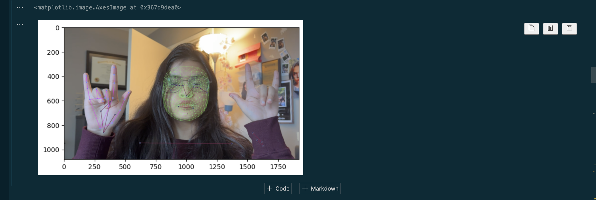

# Sign Language Detection using LSTM and MediaPipe

## Acknowledgment
This project was developed by Ritwika Das (GWID: G30941802) and Aditi Vyas (GWID: G40802010) under the supervision of Professor Robert Pless for the course *Introduction to Computer Vision (CSCI 6527_10)* at George Washington University.

## Main Aim
Our aim is to transform the way we communicate with the deaf and hard of hearing community by developing a cutting-edge sign language detection system. By integrating Long Short-Term Memory (LSTM) networks with MediaPipe technology, our project is designed to precisely recognize and interpret sign language from live video inputs.

# Process Overview

In our project, we started by setting up all the necessary tools like TensorFlow, Keras, and MediaPipe. These helped us build and manage our models effectively. We then used MediaPipe Holistic to pick up key points from video frames, which are crucial for understanding the specific movements in sign language. With these keypoints, we built a network using deep learning techniques, specifically LSTM layers, because they’re great for predicting sequences, which is exactly what we need for recognizing sign language from videos. Finally, we brought our project to life by making it work in real-time. This meant our system could take live video, spot the important gestures, and use our model to interpret these gestures right as they happen.

## Learning Outcomes

Through this project, we gained practical skills in several advanced areas of technology:

- Keypoint Extraction: We learned how to use MediaPipe Holistic to extract keypoints, essential for recognizing the nuanced gestures of sign language.
- Model Development: We developed expertise in building and training deep learning models, with a focus on LSTM layers ideal for action detection in video sequences.
- Real-Time Application: We applied our model to real-world scenarios, enabling real-time sign language prediction directly from video inputs.

These efforts have not only boosted our skills but also pushed us forward in using computer vision to improve how we communicate.

# Running the Code

This section guides you through the steps necessary to set up and run the project code effectively.

## Step 1: Imported and Installed Dependencies
We began by installing all required dependencies to ensure our setup matched the project requirements. We used the following command to install them:

```bash
pip install tensorflow==2.18.0 opencv-python mediapipe scikit-learn matplotlib
```

## Step 2: Keypoints using MP Holistic
In our project, we took advantage of the MediaPipe framework, specifically using its Holistic model to extract keypoints from video inputs. First, we set up MediaPipe’s components to prepare for processing. This setup involved initializing the system to analyze frames for human gestures and poses essential for sign language interpretation.

Next, we wrote functions to manage the video input and execute the detection tasks. These functions allowed us to process the video data efficiently, enabling the Holistic model to identify and extract important spatial landmarks or keypoints from each frame. These keypoints are critical as they mark precise locations of body parts such as the face, hands, and posture, which are all vital for capturing the dynamic movements of sign language.

By understanding these movements, our system could accurately recognize and interpret various signs. The ability to track and visualize these human gestures in real-time was key to developing our sign language detection tool, ensuring it works effectively in real-world situations.

Here’s an example picture showing how keypoints are mapped on a person performing sign language:



## Step 3: Extract Keypoint Values
We extracted keypoints from poses, faces, and hands. These keypoints were critical as they represented the coordinates necessary for the LSTM model to learn the sign language gestures. The keypoints were saved as numpy arrays for further processing.

## Step 4: Setup Folders for Collection
We organized our dataset by creating directories for each action our model needed to recognize. This structured approach helped us manage and access video data efficiently during training and testing.

## Step 5: Collect Keypoint Values for Training and Testing
Using our webcam, we captured video sequences. As we performed or displayed sign language gestures in front of the camera, the system extracted and stored keypoints from each video frame. These keypoints served as the training and testing data for our LSTM model. 

For each label, it collected 30 frames which were shown at the top-left corner of the window written as "Collecting frames from {label} Video Number: {number}". The labels were "Thanks", "Hello", and "I love you". For this, we clicked 15 frames with the right hand and the next 15 frames with the left hand. Below are the sample pictures taken:


## Step 6: Preprocess Data and Create Labels and Features
We prepared our data for the LSTM network by creating labels and organizing sequence data. This preprocessing step converted raw keypoints into a structured format that the neural network could understand and learn from.

## Step 7: Build and Train LSTM Neural Network
We constructed the LSTM model using TensorFlow and trained it with the collected data. This step involved defining the architecture of the LSTM network and tuning parameters to optimize performance.

## Step 8: Make Predictions
We used the trained model to make predictions on new video data to test the effectiveness of our sign language detection system. This allowed us to validate the model's accuracy and make necessary adjustments.

## Step 9: Evaluation
We evaluated the model's performance using metrics such as the confusion matrix and accuracy rate. This evaluation helped us identify strengths and weaknesses in the model's ability to recognize different sign language gestures.

## Step 10: Real-Time Testing
Finally, we tested the system in real-time with live video input from our webcam. This step was essential to see how the model performed in practical scenarios and provided insights into real-world application feasibility. Below are the example pictures taken during the real-time prediction:


