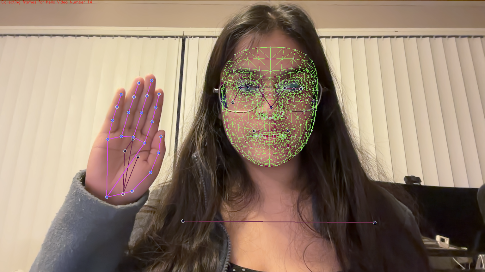

# Sign Language Detection using LSTM and MediaPipe

## Acknowledgment

This project was developed by Ritwika Das (GWID: G30941802) and Aditi Vyas (GWID: G40802010) under the supervision of Professor Robert Pless for the course *Introduction to Computer Vision (CSCI 6527_10)* at George Washington University.

## Main Aim

Our aim is to transform the way we communicate with the deaf and hard of hearing community by developing a cutting-edge sign language detection system. By integrating Long Short-Term Memory (LSTM) networks with MediaPipe technology, our project is designed to precisely recognize and interpret sign language from live video inputs. To refine our approach and ensure effectiveness, we drew inspiration from external resources, including educational videos, for designing the LSTM architecture, enriching our understanding and application of this advanced technology.

# Process Overview

In our project, we started by setting up essential tools like TensorFlow, Keras, and MediaPipe. These tools helped us build and manage our models effectively. We used MediaPipe Holistic to capture important points from video frames, crucial for recognizing sign language movements. With these keypoints, we built a network with LSTM layers, which are great for predicting sequences—exactly what we need to interpret sign language from videos. We made our system work in real time, allowing it to process live video, detect important gestures, and interpret them on the spot.

Our sign language detection system recognizes gestures quickly and operates in real time. It processes gestures in milliseconds, ensuring smooth communication. We built and tested the system on a standard computer with a GPU, using TensorFlow to handle the computations efficiently.

## Learning Outcomes

Through this project, we gained practical skills in several advanced areas of technology:

- Keypoint Extraction: We learned how to use MediaPipe Holistic to extract keypoints, essential for recognizing the nuanced gestures of sign language.
- Model Development: We developed expertise in building and training deep learning models, with a focus on LSTM layers ideal for action detection in video sequences.
- Real-Time Application: We applied our model to real-world scenarios, enabling real-time sign language prediction directly from video inputs.

These efforts have not only boosted our skills but also pushed us forward in using computer vision to improve how we communicate.

# Running the Code

This section guides you through the steps necessary to set up and run the project code effectively.

## Step 1: Imported and Installed Dependencies
We began by installing all required dependencies to ensure our setup matched the project requirements. We used the following command to install them:

```bash
pip install tensorflow==2.18.0 opencv-python mediapipe scikit-learn matplotlib
```

## Step 2: Keypoints using MP Holistic

In our project, we took advantage of the MediaPipe framework, specifically using its Holistic model to extract keypoints from video inputs. First, we set up MediaPipe’s components to prepare for processing. This setup involved initializing the system to analyze frames for human gestures and poses essential for sign language interpretation.

Next, we wrote functions to manage the video input and execute the detection tasks. These functions allowed us to process the video data efficiently, enabling the Holistic model to identify and extract important spatial landmarks or keypoints from each frame. These keypoints are critical as they mark precise locations of body parts such as the face, hands, and posture, which are all vital for capturing the dynamic movements of sign language.

By understanding these movements, our system could accurately recognize and interpret various signs. The ability to track and visualize these human gestures in real-time was key to developing our sign language detection tool, ensuring it works effectively in real-world situations.

Here’s an example picture showing how keypoints are mapped on a person performing sign language:


## Step 3: Extract Keypoint Values

In this, we focused on extracting keypoints from the poses, faces, and hands captured in the video frames, as mentioned. These keypoints are essentially the coordinates that pinpoint critical positions and movements of the signer. They are vital for our LSTM model because they serve as the data input that teaches the model how to interpret different sign language gestures accurately. We saved these keypoints as numpy arrays, which allowed us to efficiently manage and process this data for the subsequent stages of our project.

## Step 4: Setup Folders for Collection

We organized our dataset by creating directories for each action our model needed to recognize. This structured approach helped us manage and access video data efficiently during training and testing.

## Step 5: Collect Keypoint Values for Training and Testing

We used our webcam to capture video sequences that showcased various sign language gestures. As we performed each gesture in front of the camera, our system was hard at work extracting keypoints from every video frame. 

To ensure our model learned effectively, we organized the data collection into specific labels. For each sign gesture—like "Hello," "Goodbye," "Please," "Thank you," "Yes," and "No"—the system captured 30 frames. The process was clearly monitored, as each frame collection was displayed in the top-left corner of our interface, indicating "Collecting frames from {label} Video Number: {number}". To add diversity to our data, we alternated between using my right and left hands, capturing 15 frames with one hand followed by 15 frames with the other.

Below are some sample pictures that illustrate the frames we collected:




## Step 6: Preprocess Data and Create Labels and Features

In this step, we took the keypoints we had captured and got them ready for the LSTM network. We labeled each set of movements with the correct sign language gesture and organized them into a clear sequence. This way, we turned the raw keypoints into a structured format that our neural network could easily understand and learn from.

## Step 7: Build and Train LSTM Neural Network

We developed our LSTM model using TensorFlow, focusing on setting up a straightforward network that could handle sign language gestures. We designed the model's structure simply and then trained it with the data we had collected. 

## Step 8: Make Predictions

After training our LSTM model, we put it to the test by running it on new video data. This was our chance to see how effectively it could recognize different sign language gestures in real-world scenarios. Testing allowed us to measure the model's accuracy and see where it excelled and where it might need improvement. By observing how the model performed, we were able to identify specific areas that required adjustments. This step was crucial for refining the system, ensuring that it not only worked accurately but also reliably under various conditions.

## Step 9: Evaluation

To understand how well our LSTM model was performing, we used key metrics like the confusion matrix and accuracy rate. 
The confusion matrix revealed that for each gesture, the model achieved 100% precision, meaning it correctly identified gestures without any false positives or false negatives. 
Additionally, the overall accuracy rate was 100%, showcasing that the model made correct predictions for all test samples.

These tools gave us a clear picture of the model's effectiveness at recognizing sign language gestures. By analyzing these metrics, we were able to pinpoint where the model was succeeding and confirm that no shortcomings were observed in the current test set.


## Step 10: Real-Time Testing

Finally, we brought our sign language detection system to life by testing it in real time. We used live video input from our webcam to see how the model would perform under real-world conditions. This real-time testing was vital as it showed us whether the system could effectively recognize sign language gestures as they happen, mirroring everyday interactions. This step not only tested the practicality of our system but also gave us valuable insights into its feasibility for real-world applications. Below are some example pictures we captured during these real-time predictions:


# Challenges and Failures

Throughout the development of our sign language detection system, we encountered several challenges and failures that provided crucial learning opportunities. One significant challenge was achieving consistent accuracy across different lighting conditions and backgrounds, which sometimes confused the model. 

Additionally, the model sometimes struggled to distinguish between signs that had similar motions or were visually alike, leading to confusion. These issues prompted us to refine our algorithms and consider enhancements like advanced preprocessing techniques and more robust data augmentation. Addressing these challenges not only improved our model’s performance but also deepened our understanding of practical application constraints in real-world environments.

Below is an example, where the model is confused between the signs "yes" and "no".


# Future Work

To enhance the system further:

1. Real-World Deployment: Train and test the model on more diverse datasets with varying hand shapes, sizes, and lighting conditions to improve its generalization.
2. Dynamic Gesture Support: Extend the model to recognize dynamic sequences of gestures to capture more complex sign language.
3. Text-to-Speech Conversion: Integrate a module to convert recognized gestures into spoken language, enabling seamless communication for individuals with hearing or speech impairments.
4. Mobile/Edge Deployment: Optimize the model for real-time inference on mobile or edge devices to make it more accessible and portable.

This future direction aims to create a more inclusive and practical system for gesture recognition and communication.

# Conclusion

Our LSTM-based gesture recognition model achieved 100% accuracy in our tests, showing it can accurately identify sign language gestures from hand movements. We used various evaluation methods like the confusion matrix to ensure the model is dependable and effective. It consistently recognized every gesture correctly in our controlled tests, which is promising for real-world use. This success suggests that our system could greatly help improve communication for the deaf and hard of hearing community.
